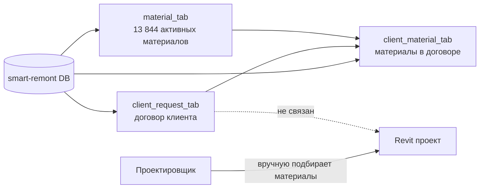
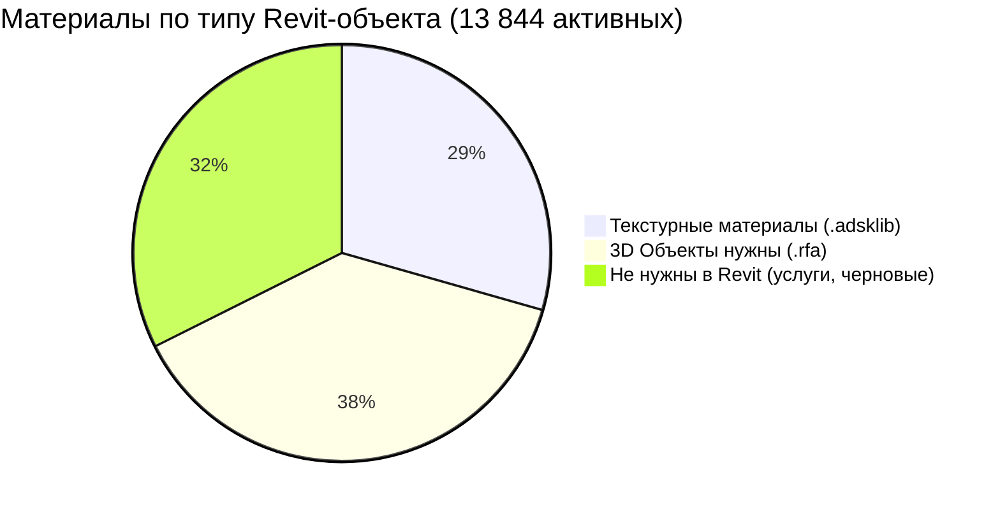
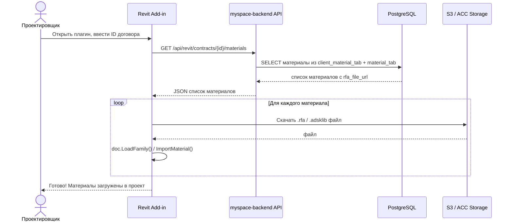
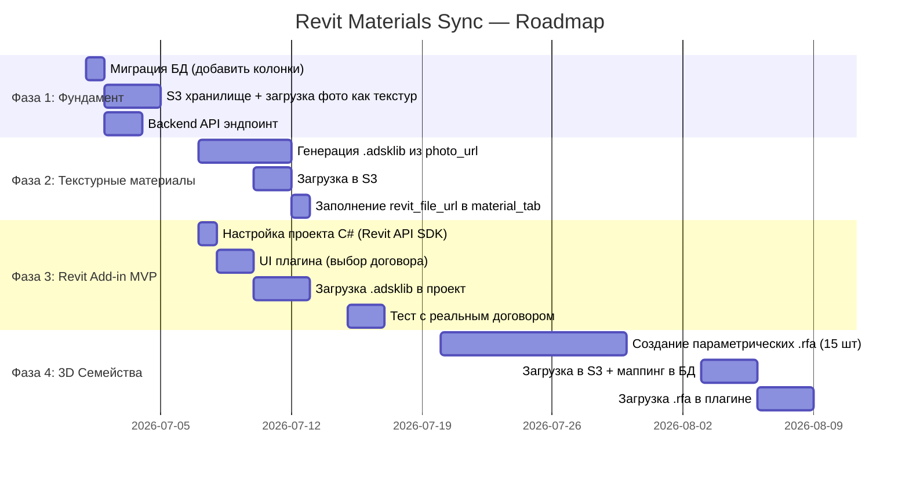

# Revit Materials Sync — Полный план

> Цель: синхронизировать материалы из договора клиента (smart-remont) в Revit-проект проектировщика.
> Дата: 25 июня 2026

---

## 1. Текущее состояние (AS-IS)



**Проблема:** Revit-проект проектировщика никак не связан с договором клиента.
Проектировщик не знает какие именно материалы выбраны в договоре.

---

## 2. Целевое состояние (TO-BE)

```mermaid
graph LR
    DB[(smart-remont DB)]
    DB --> CM[client_material_tab]
    DB --> MT[material_tab\nrfa_file_url ✨]

    API[myspace-backend API\nGET /contracts/{id}/revit-materials ✨]
    CM --> API
    MT --> API

    Storage[Облачное хранилище\nS3 / ACC ✨]
    MT -.->|rfa файлы + текстуры| Storage

    Plugin[Revit Add-in ✨\nC# плагин]
    API --> Plugin
    Storage --> Plugin
    Plugin -->|LoadFamily + ImportMaterial| Revit[Revit проект\nпроектировщика]
```

---

## 3. Что есть / чего нет

### 3.1 База данных

| Что | Статус | Примечание |
|-----|--------|------------|
| `material_tab` | ✅ Есть | 13 844 активных материалов |
| `client_material_tab` | ✅ Есть | материалы по договору |
| `client_request_tab` | ✅ Есть | договоры клиентов |
| `photo_url` в material_tab | ⚠️ Частично | только ~4 019 из 13 844 |
| `rfa_file_url` в material_tab | ❌ Нет | нужно добавить |
| `acc_urn` в material_tab | ❌ Нет | нужно добавить (если ACC) |

### 3.2 Файлы материалов

| Категория | Кол-во | Тип файла | Статус |
|-----------|--------|-----------|--------|
| Краска | 2 572 | `.adsklib` (цвет/текстура) | ❌ Нет файлов |
| Ламинат | 533 | `.adsklib` (текстура) | ❌ Нет файлов |
| Керамогранит + Кафель | 866 | `.adsklib` (текстура) | ❌ Нет файлов |
| Обои | 102 | `.adsklib` (текстура) | ❌ Нет файлов |
| Дверь межкомнатная | 1 256 | `.rfa` (3D объект) | ❌ Нет файлов |
| Мебель | 1 563 | `.rfa` (3D объект) | ❌ Нет файлов |
| Розетки/Выключатели | 1 077 | `.rfa` (3D символ) | ❌ Нет файлов |
| Смесители/Сантехника | 557 | `.rfa` (3D объект) | ❌ Нет файлов |
| Освещение | 435 | `.rfa` (3D объект) | ❌ Нет файлов |
| Услуги/Черновые материалы | ~1 000 | Не нужны в Revit | — |

### 3.3 Инфраструктура

| Что | Статус |
|-----|--------|
| Облачное хранилище для файлов | ❌ Нет |
| API эндпоинт для Revit плагина | ❌ Нет |
| Revit Add-in (плагин) | ❌ Нет |
| Design Automation for Revit (DA4R) | ❌ Нет |

---

## 4. Классификация материалов по работе в Revit



### Группа A — Текстурные материалы (~4 073 шт)
*Нужен `.adsklib` файл (Revit Material Library)*

- Краска (2 572) — цвет из каталога
- Ламинат (533) — текстура из фото
- Керамогранит / Кафель (866) — текстура из фото
- Обои (102)

> **Важно:** у ~4 019 материалов уже есть `photo_url` — можно использовать как текстуру.

### Группа B — 3D Объекты (~5 287 шт)
*Нужен параметрический `.rfa` файл*

Подход: **не 5 287 отдельных файлов**, а ~15-20 параметрических семейств:

| Семейство | Покрывает | Параметры |
|-----------|-----------|-----------|
| `door_interior.rfa` | Двери (1 256) | ширина, высота, цвет, материал |
| `furniture_cabinet.rfa` | Мебель (часть) | ширина, высота, глубина |
| `socket_switch.rfa` | Розетки/выкл (1 077) | тип, цвет |
| `faucet.rfa` | Смесители (444) | тип монтажа |
| `toilet.rfa` | Унитазы (115) | размер |
| `sink.rfa` | Раковины (114) | форма, размер |
| `bathtub.rfa` | Ванны (113) | форма, размер |
| `light_recessed.rfa` | Встраиваемое освещение (369) | диаметр |
| `light_surface.rfa` | Накладное освещение (66) | — |
| `molding.rfa` | Молдинг (358) | профиль |
| `baseboard.rfa` | Плинтус (96) | высота, цвет |

### Группа C — Не нужны в Revit (~4 484 шт)
- Услуги от подрядчика
- Черновые материалы (шпатлевка, грунтовка, клей и т.д.)
- Бытовая техника (спорно — можно добавить позже)

---

## 5. Архитектура решения



---

## 6. Изменения в БД

```sql
-- Добавить в material_tab
ALTER TABLE material_tab
    ADD COLUMN revit_file_url     VARCHAR(500),   -- ссылка на .rfa или .adsklib
    ADD COLUMN revit_file_type    VARCHAR(20),    -- 'rfa' | 'adsklib' | 'none'
    ADD COLUMN revit_family_name  VARCHAR(200),   -- имя семейства внутри .rfa
    ADD COLUMN revit_category     VARCHAR(100);   -- Revit категория (Doors, Furniture...)
```

---

## 7. Фазы реализации



### Фаза 1 — Фундамент (~1 неделя)

- [ ] Миграция БД: добавить `revit_file_url`, `revit_file_type`, `revit_family_name`, `revit_category`
- [ ] Настроить S3 bucket для хранения файлов
- [ ] API эндпоинт `GET /api/revit/contracts/{id}/materials`

### Фаза 2 — Текстурные материалы (~1.5 недели)

- [ ] Python-скрипт: для каждого материала группы A взять `photo_url`, сгенерировать `.adsklib` запись
- [ ] Загрузить `.adsklib` файл(ы) в S3
- [ ] Заполнить `revit_file_url` в `material_tab`

### Фаза 3 — Revit Add-in MVP (~2 недели)

- [ ] C# проект с Revit API 2024/2025 SDK
- [ ] Кнопка на Ribbon в Revit
- [ ] Форма: ввод ID договора → список материалов
- [ ] Скачивание файлов из S3
- [ ] `ImportFamilySymbol` / `ImportMaterial` в активный документ
- [ ] Тест с реальным договором

### Фаза 4 — Параметрические семейства (~3 недели)

- [ ] Создать ~15 параметрических `.rfa` семейств (можно нанять BIM-специалиста)
- [ ] Маппинг `material_type_id` → семейство + параметры
- [ ] Плагин: загрузка семейства + применение параметров из БД

---

## 8. Оценка трудозатрат

| Фаза | Разработчик | BIM-специалист | Итого |
|------|-------------|----------------|-------|
| 1. Фундамент | 3 дня | — | 3 дня |
| 2. Текстурные материалы | 4 дня | — | 4 дня |
| 3. Revit Add-in MVP | 8 дней | — | 8 дней |
| 4. Параметрические .rfa | 3 дня | 10 дней | 13 дней |
| **Итого** | **18 дней** | **10 дней** | **~28 рабочих дней** |

> MVP (Фазы 1-3): **~3 недели** — проектировщик получает материалы-текстуры в проекте.
> Полная версия (+ Фаза 4): **~6 недель**.

---

## 9. Технический стек

| Компонент | Технология |
|-----------|------------|
| Backend API | Python / FastAPI (существующий myspace-backend) |
| Хранилище файлов | AWS S3 или ACC Document Management |
| Revit Add-in | C# .NET 8, Revit API 2024/2025 |
| Генерация .adsklib | Python + XML (adsklib — это XML формат) |
| БД | PostgreSQL (существующий smart-remont) |

---

## 10. Риски

| Риск | Вероятность | Митигация |
|------|-------------|-----------|
| Мало фото у материалов | Высокая — только 29% с фото | Использовать placeholder текстуры по категории |
| Сложность создания .rfa | Высокая | Найти BIM-специалиста + использовать BIMobject |
| Разные версии Revit у проектировщиков | Средняя | Собирать плагин под Revit 2023/2024/2025 |
| photo_url недоступны извне | Средняя | Проверить доступность, перекачать в S3 |
