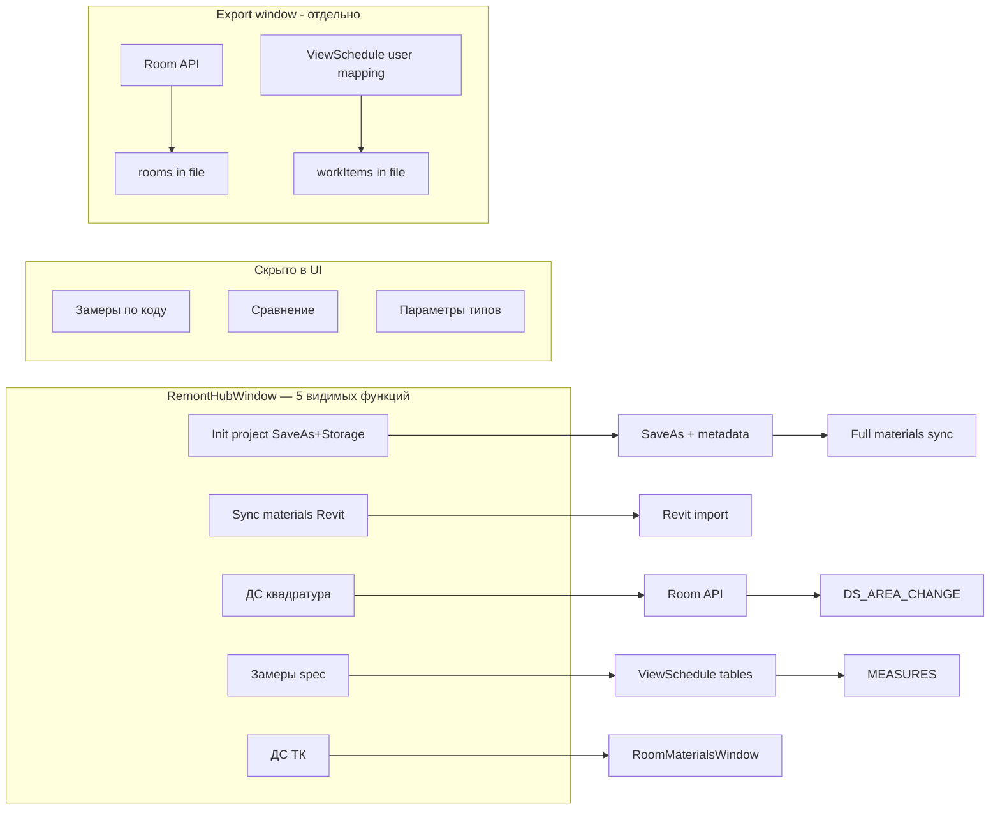

# Поток пользователя и экраны

## Активный поток (кнопка ленты)

Файл: `SBS/Commands/ExportSmartRemontRoomsCommand.cs`

```
Лента «Smart Remont» → SmartRemont
  │
  ├─► AuthLoginWindow          (если нет сессии — BaseCommand.EnsureAuthenticated)
  │
  ├─► Auto-bind (до Home)      ProjectRemontBindingService.TryBindFromDocument(doc)
  │     Storage на ProjectInformation → SelectedRemont без поиска
  │
  ├─► HomeWindow               (поиск и выбор ремонта; при bind — баннер «Продолжить»)
  │     DialogResult = true → SelectedRemont сохранён
  │
  └─► RemontHubWindow          (хаб: 5 видимых функций, первая — Init)
        DialogResult = true при закрытии (в т.ч. после отправки раздела)
```

> **Важно:** `ExportSmartRemontRoomsWindow` в команде **закомментирован / не вызывается**. Полный JSON-экспорт в файлы — отдельный сценарий (окно есть в проекте).

---

## 1. AuthLoginWindow

| | |
|---|---|
| **Файлы** | `Views/AuthLoginWindow.xaml`, `AuthView.xaml` (dockable) |
| **Когда** | Нет `CurrentSession` или истёк токен |
| **Действие** | `POST {apiOriginUrl}/auth/revit/login/` |
| **Результат** | `AuthSession` → `ExportRoomsApplication.CurrentSession`, файл `auth.session.json` |

Dockable pane (`ViewContainer` + `AuthView`) зарегистрирован при старте Revit, `VisibleByDefault = false`. Основной UX — модальное окно входа.

---

## 2. HomeWindow

| | |
|---|---|
| **Файлы** | `Views/HomeWindow.xaml(.cs)`, `Views/AppStyles.xaml` |
| **Сервис** | `RemontService.QuickSearchAsync(byRemontId: true, id)` |
| **API** | `POST /client_request/quick_search/` |
| **Размер** | Width 900 (`WindowLayoutHelper.HomeDefaultWidth`), MinWidth 760 |

### UI

- Заголовок «Smart Remont» + приветствие: имя из `session.DisplayName`
- Кнопка **«Выйти»** (logout) справа в шапке
- **Только поиск по ID ремонта** — radio «По ID заявки» убраны
- Поле с placeholder «Введите ID ремонта», кнопка **«Найти»**, **Enter** — поиск
- Inline **ProgressBar** (indeterminate) при загрузке; текст кнопки не меняется
- Состояния статуса: подсказка / «Поиск…» / «Ничего не найдено» / ошибка / «Найдено N — выберите карточку»
- Список **карточек** (ListBox): название, клиент, бейджи «Заявка #» / «Ремонт #»
- **Один клик по карточке** → `SelectedRemont` сохранён, `DialogResult = true`, переход в hub
- Если в открытом RVT уже есть **Extensible Storage** (`ProjectRemontMetadataService.TryRead`):
  - баннер **«Ремонт привязан к проекту #…»** (после enrich — с названием ремонта)
  - кнопка **«Продолжить»** → hub без поиска (`ContinueToHubButton`)
- Внизу **«Отмена»** (`DialogResult = false`)

### Результат

`ExportRoomsApplication.SelectedRemont` = `RemontOption`:

- `RemontId`, `ClientRequestId`, `Name`, `ClientName`, `ResidentName`, `FlatNum`, `PresetName`

Без `RemontId > 0` отправка revit_events **недоступна** (кнопки в дочерних окнах disabled).

---

## 3. RemontHubWindow

| | |
|---|---|
| **Файлы** | `Views/RemontHubWindow.xaml(.cs)`, `Views/AppStyles.xaml` |
| **Вход** | `Document` активного проекта |
| **Размер** | Width 960 (`WindowLayoutHelper.HubDefaultWidth`), MinWidth 880 |

### Шапка (hero)

- Крупно в одной строке: **`Ремонт #…`** (30 px) + **`Заявка #…`** (24 px, primary `#1B6FC8`)
- Ниже — `RemontOption.Name` (muted, если есть)
- Блок info (2×2, uppercase labels): **КЛИЕНТ**, **ЖК**, **КВАРТИРА**, **ПАКЕТ** — ID в этом блоке не дублируются

### Карточки функций (видимые, порядок)

| # | Кнопка | Окно / действие | Подзаголовок | API / действие |
|---|--------|-----------------|--------------|----------------|
| 0 | Инициализировать проект | `ProjectInitService` (in-place) | Копия RVT, remont_id в модели, все материалы | SaveAs + Storage + full sync |
| 1 | Синхронизация материалов из Revit | `RevitMaterialsWindow` | Загрузка RFA и surface-типов из Smart Remont | импорт материалов |
| 2 | ДС на изменение квадратуры | `SelectedRemontSummaryWindow` | Отправка площадей помещений в Smart Remont | `DS_AREA_CHANGE` |
| 3 | Замеры комнат (из спецификаций) | `RoomMeasurementsWindow` | Отправка замеров из ведомостей Revit | `MEASURES` |
| 4 | ДС на изменение ТК | `RoomMaterialsWindow` | ДС на изменение технологической карты | — |

### Project Init (инициализация RVT)

**Сервисы:** `ProjectInitService`, `ProjectCopyService`, `ProjectFileNamingService`, `ProjectRemontMetadataService`, `RevitMaterialsSyncOrchestrator`.

**Когда:** пользователь открыл шаблон или несохранённый RVT, выбрал ремонт на Home, нажал **«Инициализировать проект»** в hub.

**Шаги (автоматически):**

1. Проверка конфликта: если Storage уже содержит **другой** `remont_id` → блок с диалогом
2. `RevitMaterialsService.ReadAsync(remontId)` — список материалов
3. **SaveAs** → `%USERPROFILE%\Documents\SmartRemont\Projects\{remont_id}_{ЖК}.rvt`
   - имя: `ProjectFileNamingService.BuildFileName` — sanitize `ResidentName`, fallback `Name`, иначе `{id}_Remont`
   - существующий файл → confirm «будет перезаписан» (`overwriteExistingFile: true`)
4. **Stamp** Extensible Storage на `ProjectInformation` (`remont_id`, `client_request_id`, `initialized_at`, `plugin_version`)
5. **Full sync** всех RFA + surface через `RevitMaterialsSyncOrchestrator.SyncAllAsync`
6. `doc.Save()`

**UI hub после init:**

- бейдж на карточке **«Инициализирован #…»**
- hero-бейдж **«Проект инициализирован · #…»**
- progress в `StatusTextBlock`; успех — `AppMessageDialog.ShowSuccess` + напоминание открыть сохранённый файл, если активная модель не переключилась

**Auto-bind при открытии init-файла:**

- `ExportSmartRemontRoomsCommand` → `ProjectRemontBindingService.TryBindFromDocument(doc)` **до** Home
- Home: баннер + «Продолжить»; Hub: корректный `SelectedRemont` и badge
- `TryEnrichFromQuickSearchAsync` подтягивает имя клиента, ЖК, квартиру из API

**Обычный RVT без Storage:** прежний flow — поиск ремонта на Home обязателен.

### Скрытые пункты (код сохранён, `Visibility=Collapsed`, `// TODO: plugin-ui-redesign`)

| Было | Окно |
|------|------|
| Замеры по коду | `RoomMeasurementsFromCodeWindow` |
| Сравнение замеров | `RoomMeasurementsCompareWindow` |
| Изменение параметров типов | `TypeParameterChangeWindow` |

Stub **«ДС по изменению ТК (Скоро)»** (`DsTkChangeButton`) удалён — функция объединена с п.4.

При загрузке хаба параллельно запрашиваются статусы для п.2–3:

- `GET .../revit_events/status/?remont_id=&type=DS_AREA_CHANGE`
- `GET .../revit_events/status/?type=MEASURES`

Бейджи «Отправлено» на карточках: `RevitEventStatusUi`, суффикс даты — `RevitEventStatusFormatter`.

---

## 4. SelectedRemontSummaryWindow — ДС площади

| | |
|---|---|
| **Файлы** | `Views/SelectedRemontSummaryWindow.xaml(.cs)` |
| **Сбор данных** | `RoomAreaService.CollectRooms(doc)` |
| **Отправка** | `RevitEventsService.SendDsAreaChangeAsync` |

### Что показывает

- Таблица: номер, имя помещения, площадь м², высота потолка по комнате
- Подсказка фазы: **«После монтажных работ»** (или первая фаза)
- Одна **общая** `wall_height` в payload (мода/максимум высот по строкам — см. `ResolvePayloadWallHeight`)
- Итого площадь и количество помещений
- Баннер статуса последнего события `DS_AREA_CHANGE`

### Источник данных

**Не ведомости.** Элементы `Room`:

- `ROOM_AREA`, `ROOM_NAME`, `ROOM_NUMBER`
- фаза `ROOM_PHASE`
- высота: расчёт по стенам помещения, иначе параметры Room

Подробнее: [DATA_SOURCES.md](DATA_SOURCES.md).

---

## 5. RoomMeasurementsWindow — замеры

| | |
|---|---|
| **Файлы** | `Views/RoomMeasurementsWindow.xaml(.cs)` |
| **Сбор** | `RoomMeasurementsService.Collect(doc)` при `Loaded` |
| **Отправка** | `RevitEventsService.SendMeasuresAsync` |

### Что показывает

- Список помещений → список параметров (`param_code`, `param_name`, значение)
- Блок **«Источники»** (`Sources`): по каждому параметру — ожидаемая ведомость, найденная ведомость, колонки, статус
- Переключатель видимости маппинга (справочный текст из `RoomMeasurementsScheduleMapping`)
- Баннер статуса `MEASURES`

### Payload

`MeasuresPayloadDto`: `rooms[]` → `room_name` + `parameters[]` с `param_code`, `param_name`, `param_value`.

Отправляются только параметры с непустым `param_value`.

Подробнее: [ROOM_MEASUREMENTS_MAPPING.md](ROOM_MEASUREMENTS_MAPPING.md).

---

## 6. ExportSmartRemontRoomsWindow — экспорт JSON (вне основного потока)

| | |
|---|---|
| **Файлы** | `Views/ExportSmartRemontRoomsWindow.xaml(.cs)` |
| **Выход** | Файл `SmartRemont_Rooms_*.json` на рабочем столе |
| **Побочный файл** | `{имя_экспорта}.mapping.json` |

### Секции UI

1. Фаза, фильтры помещений, превью комнат
2. Маппинг **произвольных** shared-параметров Room (номер квартиры, отделка, IFC…)
3. Опции: контуры, отделка (пол/потолок/GenericModel)
4. **DataGrid спецификаций** — включить/выключить, Discipline, WorkType, имена колонок
5. Путь выходного JSON, кнопка экспорта

### Результат JSON

`SmartRemontRoomsExportDto`:

- `rooms[]` — из `Room` + опционально finishes/contours
- `workItems[]` — из **включённых** ведомостей по пользовательскому маппингу

Не путать с автоматическими замерами `MEASURES`: другой маппинг, другой выход (файл vs API).

Подробнее: [EXPORT_SCHEDULES_MAPPING.md](EXPORT_SCHEDULES_MAPPING.md).

---

## 7. Вспомогательные UI

| Окно / control | Назначение |
|----------------|------------|
| `SuccessDialog` | Успешная отправка |
| `AppMessageDialog` | Сообщения, «в разработке» |
| `ViewContainer` + `AuthView` | Dockable pane |
| `WindowLayoutHelper` | Full WorkArea height, centering; `HomeDefaultWidth` 900, `HubDefaultWidth` 960 |
| `AppStyles.xaml` | Общие Card, PrimaryButton, SectionLabel, палитра `#1B6FC8` / `#F0F2F5` |

---

## Диаграмма данных по экранам


